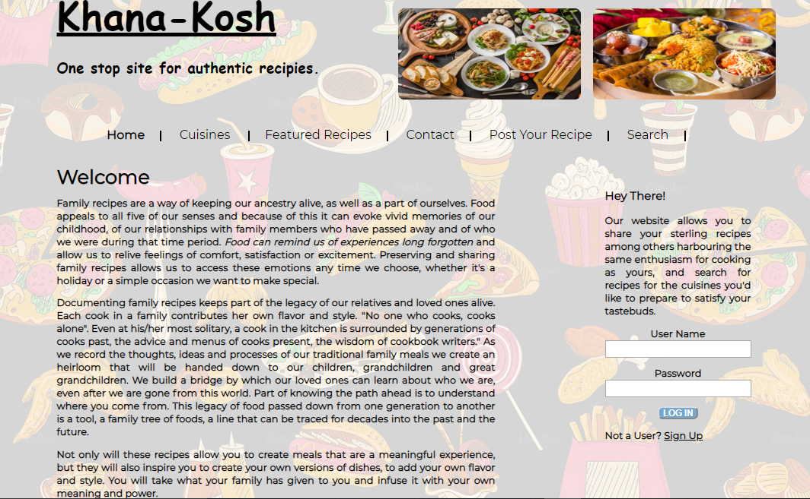
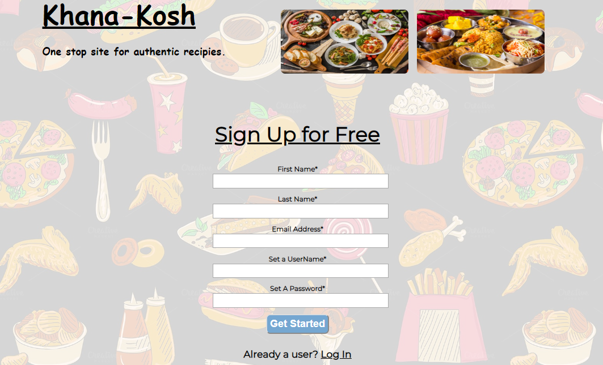

To run open any server eg xampp -> run Apache -> run MysQL and on chrome write http://localhost/<Folder_name>/after_login/index1.php

Details on the phpMyAdmin will be updated

Recipe-Sharing Website: Khana-Kosh
Tried to create a website where users can share their prepared recipes among others and can also search the recipes for different cuisines they’d like to prepare. We have
used the functionalities of HTML, CSS, Javascript, Jquery and PHP to implement the site.

#Ignore the alt text in Read Me file

Home Page:

Sign-up Page for new users:

Login Page

continued:

continued:

Page for posting your recipe once you’ve logged in:

continued:

Page for searching for a recipe:

A contact page for the users to get in touch with the admin:

Contact continue:

Contact continue:

Page that shows the featured recipes:

Clicking on read more will show the details of all the recipes posted for the dish:

Page that shows the top cuisines for which recipes are posted:

Clicking on explore more shows all the recipes posted under that cuisine:

Page that allows the user to search for a recipe that has been already posted:

continued:

